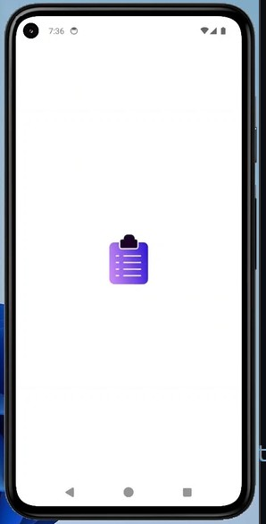
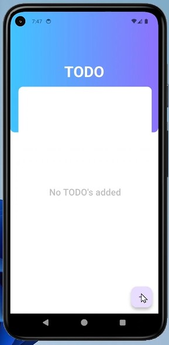
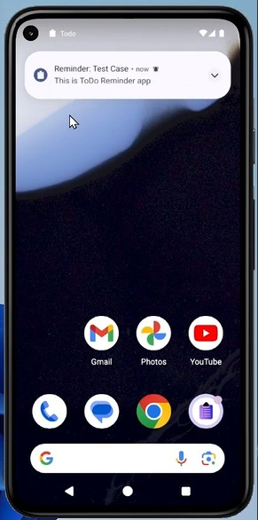

# 📱 Todo App - Task Manager with Smart Reminders

[](https://flutter.dev)
[](https://dart.dev)
[](LICENSE)
[](https://www.android.com)

A beautiful and functional Todo application built with Flutter that helps you organize tasks with **smart reminders** and **exact notifications**. Never miss a deadline again!

<p align="center">
  
</p>

---

## ✨ **Features**

### 🎯 **Core Features**
- ✅ **Create & Manage Tasks** - Add, edit, and delete tasks effortlessly
- ⏰ **Smart Reminders** - Set exact date/time for task notifications
- 🔔 **Reliable Notifications** - Works even when app is closed
- 📱 **Beautiful UI** - Clean, modern interface with smooth animations
- 💾 **Local Storage** - SQFlite database for offline functionality

### 🚀 **Advanced Features**
- 📅 **Date & Time Picker** - Intuitive scheduling interface
- 🔄 **Boot Support** - Reminders persist after phone restart
- 🎨 **Custom Notifications** - Configurable notification sounds and vibrations
- ⚡ **Performance Optimized** - Fast and responsive user experience
- 🔒 **Permission Handling** - Proper Android 12+ permission management

---

## 📸 **Screenshots**

| Splash Screen | Home Screen | Add Task | Notifications |
|---------------|-------------|----------|---------------|
|  |  |  |  |

---

## 🛠️ **Tech Stack**

### **Frontend**
- **Flutter 3.16** - Cross-platform framework
- **Dart 3.0** - Programming language
- **Material Design** - UI components and theming

### **Backend & Storage**
- **SQFlite** - Local SQLite database for task storage
- **Shared Preferences** - Local storage for app settings

### **Notifications**
- **flutter_local_notifications** - Local notification system
- **timezone** - Timezone-aware scheduling
- **permission_handler** - Android permission management

### **State Management**
- **Provider** - Efficient state management pattern
- **ChangeNotifier** - Reactive state updates

### **Architecture**
- **MVC Pattern** - Clean separation of concerns
- **Repository Pattern** - Data layer abstraction

---

## 📦 **Installation**

### **Prerequisites**
- Flutter SDK 3.16.0 or higher
- Android Studio / VS Code
- Android SDK (min: API 21, target: API 34)

### **Setup Instructions**
1. **Clone the repository**
   ```bash
   git clone https://github.com/yourusername/todo-app.git
   cd todo-app
   ```

2. **Install dependencies**
   ```bash
   flutter pub get
   ```

3. **Run the app**
   ```bash
   flutter run
   ```

4. **Build release APK**
   ```bash
   flutter build apk --release
   ```

---

## 🏗️ **Project Structure**

```
lib/
├── main.dart                    # App entry point
├── models/
│   └── todo_model.dart          # Task data model
├── provider/
│   └── to_do_provider.dart      # State management
├── screens/
│   ├── loading_screen.dart      # Splash/loading screen
│   ├── todo_home_screen.dart    # Main home screen
│   └── todo_input_bottomsheet.dart # Add/edit task screen
├── commons/
│   └── todo_list_tile.dart      # Task list item widget
├── database/
│   └── db_helper.dart           # Database operations
├── utils/
│   └── permissions.dart         # Permission handling utilities
└── assets/                      # Images and icons
```

---

## 🔧 **Configuration**

### **Android Configuration**
1. Update `android/app/build.gradle.kts`:
   ```kotlin
   compileSdk = 36
   minSdk = 21
   targetSdk = 36
   ```

2. Update `android/app/src/main/AndroidManifest.xml`:
   ```xml
   <uses-permission android:name="android.permission.POST_NOTIFICATIONS"/>
   <uses-permission android:name="android.permission.SCHEDULE_EXACT_ALARM"/>
   <uses-permission android:name="android.permission.RECEIVE_BOOT_COMPLETED"/>
   ```

### **Icon Configuration**
Replace app icons in:
- `android/app/src/main/res/mipmap-hdpi/`
- `android/app/src/main/res/mipmap-mdpi/`
- `android/app/src/main/res/mipmap-xhdpi/`
- `android/app/src/main/res/mipmap-xxhdpi/`
- `android/app/src/main/res/mipmap-xxxhdpi/`

---

## 📝 **Usage Guide**

### **Adding a Task**
1. Tap the **+** button
2. Enter task title (required) and description (optional)
3. Select date and time for reminder
4. Tap **SAVE TASK**

### **Editing a Task**
1. Tap the **edit (pencil)** icon on any task
2. Modify the details
3. Tap **SAVE TASK**

### **Deleting a Task**
1. Tap the **delete (trash)** icon on any task
2. Confirm deletion

### **Receiving Reminders**
- Notifications appear at scheduled time
- Works in background and after phone restart
- Tap notification to open the app

---

## 🚀 **Building for Production**

### **Create Release APK**
```bash
flutter clean
flutter pub get
flutter build apk --release
```

### **Create App Bundle (Google Play)**
```bash
flutter build appbundle
```

### **APK Location**
```
build/app/outputs/flutter-apk/app-release.apk
```

---

## 📊 **Performance Metrics**

- **App Size**: ~15MB
- **Launch Time**: < 2 seconds
- **Database Operations**: < 100ms
- **Notification Accuracy**: Exact to the minute
- **Memory Usage**: < 50MB average

---

## 🧪 **Testing**

### **Unit Tests**
```bash
flutter test
```

### **Integration Tests**
```bash
flutter drive --target=test_driver/app.dart
```

### **Manual Testing Checklist**
- [x] Task creation/deletion
- [x] Notification scheduling
- [x] Permission handling
- [x] Database persistence
- [x] UI responsiveness

---

## 🔒 **Permissions**

### **Required Permissions**
- **POST_NOTIFICATIONS**: To show reminder notifications
- **SCHEDULE_EXACT_ALARM**: For precise timing (Android 12+)
- **RECEIVE_BOOT_COMPLETED**: To restore reminders after restart

### **Permission Flow**
1. App requests notification permission on first launch
2. Exact alarm permission requested when setting first reminder
3. Permissions can be managed in device settings

---

## 🐛 **Troubleshooting**

### **Common Issues**

| Issue | Solution |
|-------|----------|
| Notifications not working | Check app notification settings |
| App crashes on startup | Clear app cache/data |
| Reminders not firing | Grant exact alarm permission |
| Database errors | Reinstall app or clear storage |

### **Logging**
```dart
// Enable debug logging
debugPrint("Log message");
```

---

## 📈 **Roadmap**

### **Planned Features**
- [ ] Cloud sync with Firebase
- [ ] Task categories and tags
- [ ] Recurring tasks
- [ ] Task prioritization
- [ ] Dark mode support
- [ ] Widget for home screen
- [ ] Export tasks to CSV/PDF
- [ ] Voice input for tasks

### **Future Improvements**
- [ ] iOS support
- [ ] Web version
- [ ] Analytics integration
- [ ] Advanced reporting
- [ ] Team collaboration features

---

## 🤝 **Contributing**

We love contributions! Here's how you can help:

1. **Fork** the repository
2. **Create** a feature branch (`git checkout -b feature/AmazingFeature`)
3. **Commit** your changes (`git commit -m 'Add AmazingFeature'`)
4. **Push** to the branch (`git push origin feature/AmazingFeature`)
5. **Open** a Pull Request

### **Development Guidelines**
- Follow Flutter style guide
- Write meaningful commit messages
- Add tests for new features
- Update documentation

---

## 📚 **Learning Resources**

### **Flutter Basics**
- [Flutter Documentation](https://flutter.dev/docs)
- [Dart Language Tour](https://dart.dev/guides/language/language-tour)
- [Flutter Widget Catalog](https://flutter.dev/docs/development/ui/widgets)

### **Advanced Topics**
- [Local Notifications](https://pub.dev/packages/flutter_local_notifications)
- [SQFlite Database](https://pub.dev/packages/sqflite)
- [Provider State Management](https://pub.dev/packages/provider)

---

## 👨‍💻 **Author**

**Your Name**
- GitHub: [Rafia Asim](https://github.com/Rafia-Syed))
- LinkedIn: [Rafia Asim](https://linkedin.com/in/rafia-asim-flutter/))

---

## 📄 **License**

This project is licensed under the MIT License - see the [LICENSE](LICENSE) file for details.

```
MIT License

Copyright (c) 2025 Rafia Asim

Permission is hereby granted...
```

---

## 🌟 **Show Your Support**

If you find this project helpful, please give it a ⭐️ on GitHub!

---

## 📞 **Support**

For support, email rafia.asim90@gmail.com or create an issue in the GitHub repository.

---

**Built with ❤️ using Flutter**

---

## 🔗 **Useful Links**

- [Flutter Packages Used](#)
- [API Documentation](#)
- [Changelog](CHANGELOG.md)
- [Code of Conduct](CODE_OF_CONDUCT.md)

---

*Last Updated: December 2025*
